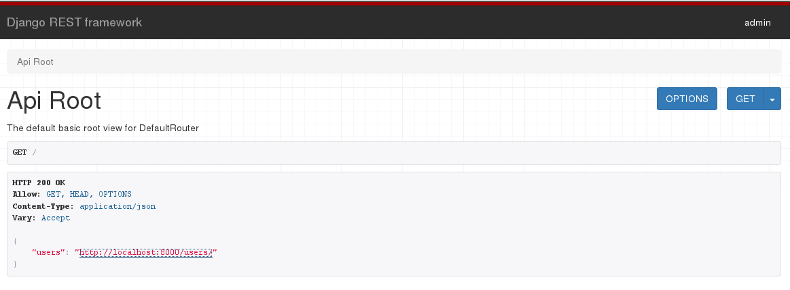
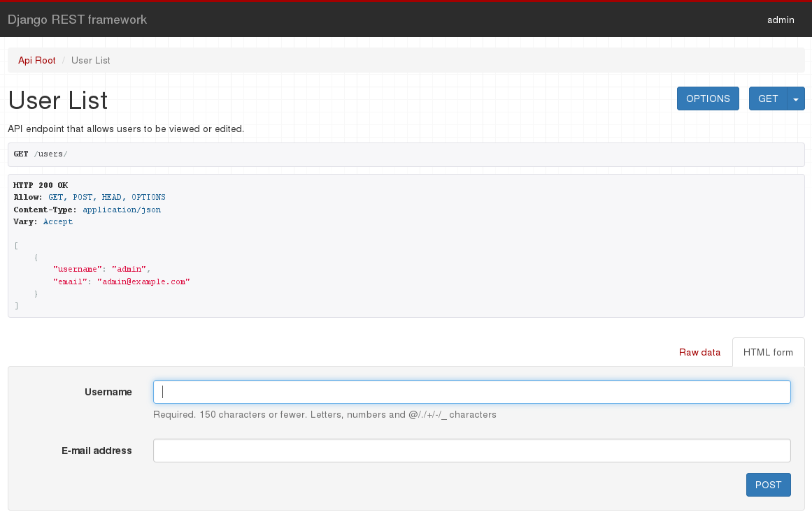

# Quickstart

We're going to create a simple API to allow admin users to view users in the
system.

As a side effect we introduce Django and MongoEngine interaction and
configuration.

## Project setup

### Django and MongoEngine
The first step will be to get Django and a MongoDB instance working together.

Create a new Django project named `tutorial`, then start a new app called `quickstart`.

    # Create the project directory
    mkdir tutorial
    cd tutorial

    # Create a virtualenv to isolate our package dependencies locally
    virtualenv env
    source env/bin/activate  # On Windows use `env\Scripts\activate`

    # Install Django and Django REST framework into the virtualenv
    pip install django
    pip install mongoengine
    pip install git+https://github.com/MongoEngine/django-mongoengine.git

    # Set up a new project with a single application
    django-admin.py startproject tutorial .  # Note the trailing '.' character
    django-admin.py startapp quickstart
    cd ..

Now configure the project to use MongoEngine. In `settings.py` add

		INSTALLED_APPS = [
				...,

				'django_mongoengine',
				'django_mongoengine.mongo_auth',
				'django_mongoengine.mongo_admin',
		]

		AUTH_USER_MODEL = 'mongo_auth.MongoUser'

		AUTHENTICATION_BACKENDS = (
			'django_mongoengine.mongo_auth.backends.MongoEngineBackend',
		)

Edit the standard database configuration and add the MongoDB config

		DATABASES = {
				'default': { 'ENGINE': 'django.db.backends.dummy'}
		}

		MONGODB_DATABASES = {
						'default': {'name': 'quickstart'}
		}

> The `'default'` dictionary can take the options as specified by mongoengine [connect](http://docs.mongoengine.org/guide/connecting.html)

In `tutorial/urls.py`

Add `include` to the imports

	from django.conf.urls import url, include

Replace

		from django.contrib import admin

With

		from django_mongoengine import mongo_admin

Replace

    url(r'^admin/', include(mongo_admin.site.urls)),

With

    #url(r'^admin/', admin.site.urls),

Check to see the new option

		python manage.py

In the output there should be an entry
		[mongo_admin]
				createmongodbsuperuser

Create an initial user named `admin` with a password of `password123`. We'll authenticate as that user later in our example.

    python manage.py createmongodbsuperuser
		python manage.py runserver

Visit localhost:8000 and the welcome page should come up. Visit localhost:8000/admin and log in to confirm authentication works.
> At the time of writing the admin page does not allow editing.

### Django REST Framework Mongo

		pip install djangorestframework
		pip install django-rest-framework-mongoengine

Add to `tutorial/settings.py`
		INSTALLED_APPS = (
			...
			'rest_framework',
			'rest_framework_mongoengine',
			...
		)

Now we can write some code.

## Serializers

First up we're going to define some serializers. Let's create a new module named `quickstart/serializers.py` that we'll use for our data representations.

		from django_mongoengine.mongo_auth.models import User
		from rest_framework_mongoengine import serializers

		class UserSerializer(serializers.DocumentSerializer):
				class Meta:
						model = User
						fields = ('username', 'email', )

Notice that we use the models from MongoEngine and import our REST framework functionality from `rest_framework_mongoengine` as opposed to `rest_framework`.

## Views

Right, we'd better write some views then.  Open `quickstart/views.py` and get typing.

		from django_mongoengine.mongo_auth.models import User
		from rest_framework_mongoengine import viewsets
		from quickstart.serializers import UserSerializer

		class UserViewSet(viewsets.ModelViewSet):
				"""
				API endpoint that allows users to be viewed or edited.
				"""
				serializer_class = UserSerializer

				def get_queryset(self):
						return User.objects.all()

Rather than write multiple views we're grouping together all the common behavior into classes called `ViewSets`.

We can easily break these down into individual views if we need to, but using viewsets keeps the view logic nicely organized as well as being very concise.

## URLs

Okay, now let's wire up the API URLs.  On to `tutorial/urls.py`...

		from django.conf.urls import url, include
		from django_mongoengine import mongo_admin
		from rest_framework_mongoengine import routers
		from quickstart import views

		router = routers.DefaultRouter()
		router.register(r'users', views.UserViewSet,base_name="users")

		urlpatterns = [
				url(r'^admin/', include(mongo_admin.site.urls)),
				url(r'^', include(router.urls)),
		]

Because we're using viewsets instead of views, we can automatically generate the URL conf for our API, by simply registering the viewsets with a router class.

> Note: the base_name parameter is needed for the router since the viewset does not have a [`queryset` attribute](http://www.django-rest-framework.org/api-guide/routers/).

Again, if we need more control over the API URLs we can simply drop down to using regular class-based views, and writing the URL conf explicitly.

Finally, we're including default login and logout views for use with the browsable API.  That's optional, but useful if your API requires authentication and you want to use the browsable API.

## Settings

We'd also like to set a few global settings.  We'd like to turn on pagination, and we want our API to only be accessible to admin users.  The settings module will be in `tutorial/settings.py`

		REST_FRAMEWORK = {
				'DEFAULT_PERMISSION_CLASSES': [
						'rest_framework_mongoengine.permissions.IsAdminUser',
				],
				'PAGE_SIZE': 10
		}

Okay, we're done.

---

## Testing our API

We're now ready to test the API we've built.  Let's fire up the server from the command line.

    python manage.py runserver

We can now access our API, both from the command-line, using tools like `curl`...

		$ curl -H 'Accept: application/json; indent=4'  -u admin:password123 http://127.0.0.1:8000
		{
				"users": "http://127.0.0.1:8000/users/"
		}

		$ curl -H 'Accept: application/json; indent=4' -u admin:password123 http://127.0.0.1:8000/users/
		{
				"count": 1,
				"next": null,
				"previous": null,
				"results": [
						{
								"username": "admin",
								"email": "admin@example.com"
						}
				]
		}

Or using the [httpie][httpie], command line tool...

    pip install httpie

    $  http -a admin:password123 http://127.0.0.1:8000/users/
		HTTP/1.0 200 OK
		Allow: GET, POST, HEAD, OPTIONS
		Content-Length: 100
		Content-Type: application/json
		Date: Tue, 18 Jul 2017 19:48:04 GMT
		Server: WSGIServer/0.2 CPython/3.5.2+
		Vary: Accept, Cookie
		X-Frame-Options: SAMEORIGIN

		{
				"count": 1,
				"next": null,
				"previous": null,
				"results": [
						{
								"email": "admin@example.com",
								"username": "admin"
						}
				]
		}

In your browser navigate to `localhost:8000`
If you're working through the browser, make sure to login using the control in the top right corner.

Click on the `users` URL and you should see

## Issues
Using the form on the User List page to create a new user fails with a
`ValidationError`. The complaint is that the `password` is required but
missing. This is a point for investigation.

[httpie]: https://github.com/jakubroztocil/httpie#installation
